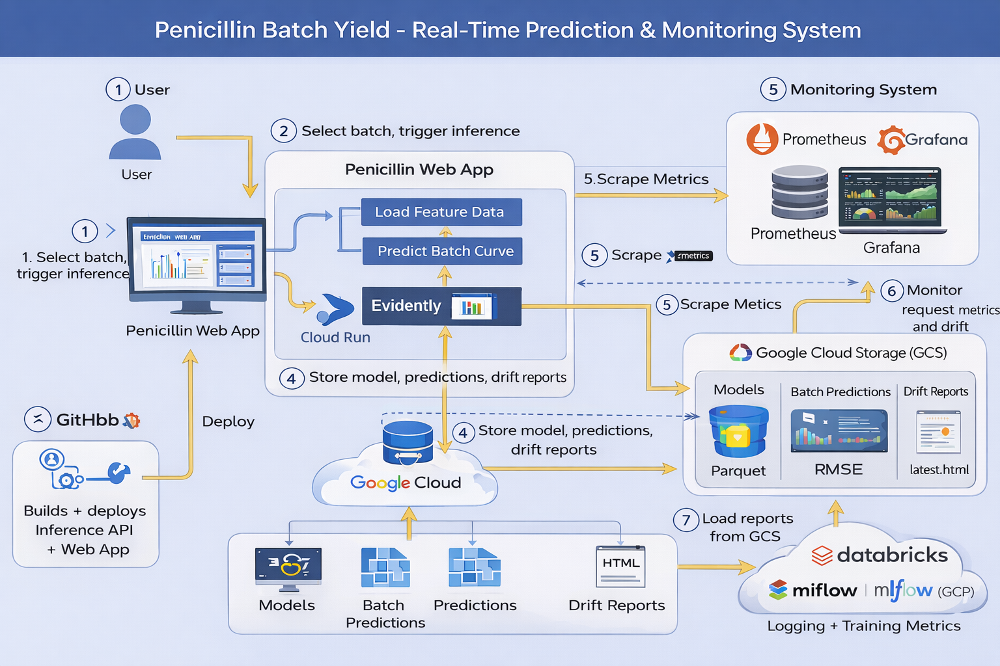

# 🧪 Penicillin Batch Yield — Real-Time ML Monitoring & Prediction System

## A production-style MLOps project that predicts penicillin concentration during batch runs and monitors model/data drift in real time.


---

## 🎯 Executive Summary

This project demonstrates an end-to-end **production-like MLOps workflow** using a realistic bioprocess scenario: predicting **penicillin concentration** during a batch fermentation run and continuously monitoring model performance and drift.

The system combines:
- A **containerized inference API** (Cloud Run)
- A **Dash web application** for interactive analysis (Cloud Run)
- **Prometheus metrics + Grafana dashboards** for operational monitoring
- **Automated drift reporting** (Evidently) published to Google Cloud Storage (GCS)

The result is a deployable web application that a non-technical user can open in a browser, run inference by batch number, and review the system’s health and drift signals.

---

## Business Problem Solved

**Challenge:** Batch bioprocesses are expensive and time-sensitive. Operators need to make decisions during the run, such as:
- When the process is approaching key concentration thresholds
- Whether incoming sensor patterns look “unusual” compared to normal operation, as these influence the resulting batch yield
- Whether model accuracy or data quality is degrading over time
- The company needs to ensure stable batch and optimum batch yields by stopping the batch run at the maximum possible pennicilin concentration in the bioreactor

**Solution:** A real-time ML system that:
- predicts the concentration curve for a selected batch
- surfaces an interpretable prediction visualization in a UI
- logs monitoring signals and drift metrics automatically
- produces drift reports for auditing and investigations

---

## ✅ Key Features

### 🔮 Real-Time Inference API (Cloud Run)
- `/run-inference` accepts a `batch_number` and returns:
  - prediction array for the batch
  - RMSE score (latest observed)
  - drift metrics (share of drifted features, per-feature drift scores)
  - drift report URI (HTML stored in GCS)
- `/metrics` exposes Prometheus metrics
- `/health` basic health check
- (Optional) `/latest_monitoring_metrics` to read last computed metrics **without re-running inference**

### 📈 Web Application (Dash)
- **Predictions page**:
  - selects a batch number
  - triggers inference
  - plots predicted concentration curve and KPI summaries
- **Monitoring page**:
  - embeds Grafana dashboards (public dashboard URL or embed link)
  - shows quick “status badges” (RMSE, drift share, feature drift)
- **Drift report page**:
  - loads latest Evidently report from GCS (via signed URL or public object)

### 📊 Monitoring (Prometheus + Grafana)
- Prometheus scrapes inference API metrics
- Grafana dashboards visualize:
  - RMSE trend
  - drift share
  - feature drift scores
  - request rate & latency

### ☁️ Cloud Storage (GCS)
- Stores:
  - raw and processed data (parquet)
  - predictions and root mean squared error scores with timestamps (parquet)
  - drift reports (`latest.html`, `latest.json`)

---

## 🏗️ Application Architecture



### Data & Control Flow (high-level)
1. User selects a batch in the web app and triggers inference  
2. Web app calls **Inference API** (Cloud Run)  
3. Inference API loads/refreshes feature data, returns predictions from inference pipeline and stores predictions and model metrics in GCS  
4. API computes drift signals + generates an Evidently report  
5. Predictions + drift reports are uploaded to **GCS**  
6. Prometheus scrapes `/metrics` and Grafana visualizes monitoring dashboards  
7. Web app embeds dashboards + loads latest drift report from GCS

---

## 🐳 Entrypoints

- `app-ml/entrypoint/inference_api.py`  
  Production inference API + Prometheus metrics + drift report generation

- `web_app/app.py`  
  Dash web application (multi-page)

- `prometheus_monitoring/prometheus.yml`  
  Prometheus scrape config

---

## 🚀 Quick Start

### Option 1: Run locally (Docker Compose)
```bash
git clone <your-repo-url>
cd pennicilin_web_app/prometheus_monitoring

docker compose up --build

# Web app
# http://localhost:8050

# Inference API
# http://localhost:5001/health

# Grafana
# http://localhost:3000
